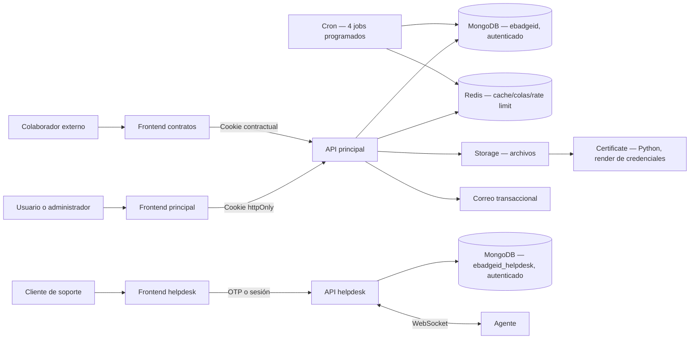

# Arquitectura del sistema

## Componentes

Corregido en la ronda de auditoría de seguridad: esta tabla listaba 6 componentes: los 13 reales, verificados contra `docker-compose.yml`, están abajo. `redis`, `certificate`, `storage` y `cron` no estaban documentados en absoluto.

| Componente | Responsabilidad | Puerto host | Expuesto al host |
|---|---|---:|---|
| `frontend` (`app`) | Administración de organizaciones, usuarios, credenciales, metas, contratos y editor | 3000 | Sí |
| `backend (updated)` (`api`) | API principal, autenticación, credenciales, diseños, contratos, SAML y analítica | 5050→5000 | Sí |
| `helpdesk_frontend` (`helpdesk`) | Portal público, seguimiento, agentes, artículos y FAQs | 3001 | Sí |
| `help_backend` (`help-api`) | API de tickets, OTP, conocimiento, chatbot y WebSocket | 8000 | Sí |
| `contract` (`contracts`) | Colaboración y firma de contratos — sin backend propio, usa la API principal | 3002 | Sí |
| `storage` | Microservicio de subida/almacenamiento de archivos (plantillas, credenciales generadas, fuentes) | 9000 | Sí |
| `certificate` | Microservicio Python (Pillow) que renderiza la imagen final de cada credencial | 8100 (interno) | **No** — solo alcanzable por `api` dentro de la red de Docker |
| `mongo` | MongoDB 7, replica set de un nodo, con autenticación real desde la ronda de auditoría de seguridad. Sirve dos bases lógicas: `ebadgeid` (principal) y `ebadgeid_helpdesk` | 27017 (interno) | **No** |
| `mongo-init` | Contenedor de un solo uso que inicializa el replica set | — | No |
| `migrate` / `help-migrate` | Migraciones de esquema, idempotentes, un contenedor de un solo uso por backend | — | No |
| `redis` | Caché (verificación pública de credenciales), cola de emisión masiva (BullMQ) y límites de tasa distribuidos | 6379 (interno) | No |
| `cron` | Misma imagen que `api`, corre `scripts/cronRunner.js`. Trabajos programados sobre BullMQ/Redis: notificación de vencimiento de credenciales, anclaje blockchain diario, purga permanente de organizaciones eliminadas (90 días) y backup cifrado diario de ambas bases de Mongo — ver PRODUCTION_RUNBOOK.md secciones 3.b y 3.c | — | No |

## Límites de seguridad

- Las sesiones de usuario viven en cookies `httpOnly`, `Secure` en producción y `SameSite=Strict`.
- Los frontends nunca necesitan leer el JWT.
- Cada recurso empresarial se limita por `organization_code` en backend; ocultar botones no sustituye autorización.
- Las invitaciones contractuales llegan en el fragmento URL, se intercambian por una cookie acotada y luego se eliminan del historial.
- Operaciones mutables validan el encabezado `Origin`; `ALLOWED_ORIGINS` es obligatorio en producción.
- Las claves API son para integraciones servidor-a-servidor y no deben utilizarse desde navegadores.
- MongoDB exige autenticación real (`--auth --keyFile`) desde la ronda de auditoría de seguridad, con un usuario de mínimo privilegio por base (`ebadgeid_app`, `ebadgeid_helpdesk_app`) — antes cualquier contenedor de la red interna podía leer o escribir toda la base sin credenciales.
- `mongo`, `redis` y `certificate` no publican ningún puerto al host — solo son alcanzables desde otros contenedores de la misma red de Docker.

## Modelo lógico

## Escalabilidad prevista

Las APIs son aptas para réplicas horizontales salvo el estado WebSocket en memoria. Para más de una réplica de helpdesk se necesita un adaptador pub/sub compartido (por ejemplo Redis) y afinidad temporal o un gateway WebSocket. Los trabajos de correo, generación y conectores deben moverse a workers con un broker durable antes de cargas altas.
