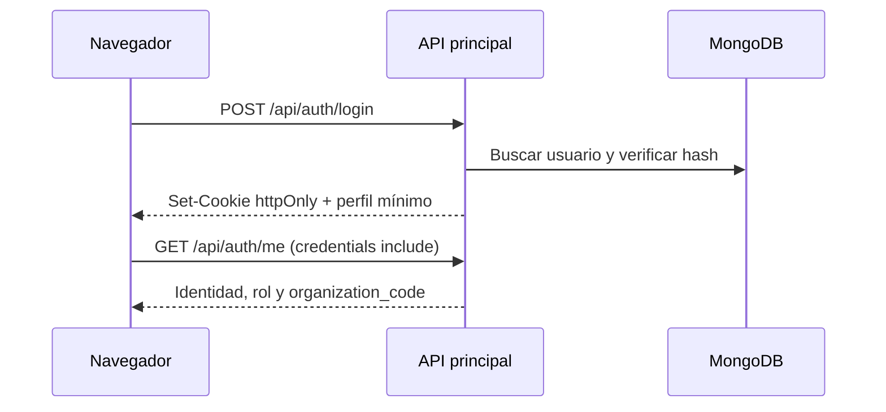
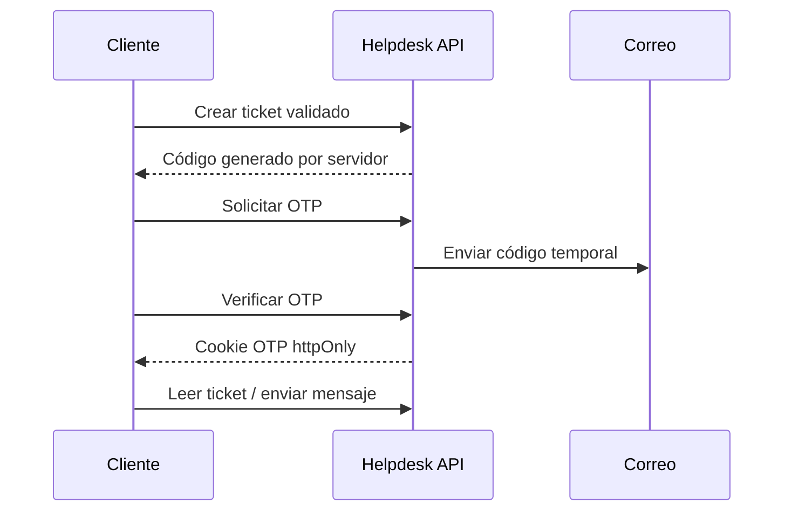

# Flujos del sistema

## Inicio de sesión

## Emisión y verificación de credencial

1. El administrador selecciona diseño, destinatario y metadatos.
2. El backend valida rol y pertenencia a la organización.
3. Se reserva un código único, se calcula la huella de integridad y se almacena la credencial.
4. Se genera el documento con QR hacia la página pública de verificación.
5. La verificación pública consulta por código y presenta estado e integridad sin exponer datos privados innecesarios.

## Ticket y seguimiento OTP

## Invitación contractual

1. El creador invita a una contraparte.
2. El backend genera un secreto aleatorio con expiración y envía un enlace cuyo secreto está en `#accessToken`.
3. El frontend intercambia el secreto una sola vez por `POST /contracts/access-session`.
4. El backend valida formato, estado, contrato y expiración; coloca una cookie acotada a `/api/contracts`.
5. El navegador limpia el fragmento y todas las lecturas, discusiones, cambios y firmas se autorizan en backend.

## Editor de diseños

El editor mantiene un historial local de estados para undo/redo. Los elementos se pueden seleccionar, ordenar, agrupar, bloquear y alinear con cuadrícula/guías. El guardado convierte el estado visual al esquema de posiciones y tipografía utilizado por la API de diseños.

## Separación multiempresa

Cada solicitud autenticada obtiene `organization_code` del JWT verificado. Los parámetros de organización se comparan con esa identidad antes de consultar o modificar datos. Las pruebas de autorización cubren accesos permitidos y denegación entre organizaciones.
